<style>
body {
text-align: justify
}
</style>

```{r setup, include=FALSE}
knitr::opts_chunk$set(
  message = FALSE,
  warning = FALSE)
```

```{r klippy, echo=FALSE, include=TRUE}
library(klippy)
klippy::klippy()
```

# 🎨 Step right into the colorful realm of R Markdown Themes! 🌸 😄

```{r, out.width = "100%", echo = FALSE, fig.align = "center"}

```

**This article can be used at will if you need it. Please copy the corresponding YAML code below 👇. Enjoy! 🏄**

# R Markdown

R Markdown is a popular tool for creating dynamic documents that combine **code**, **text**, and **visualizations**. It allows you to seamlessly integrate R code and its output with narrative text to create reproducible reports, presentations, and even websites. R Markdown themes play a crucial role in customizing the appearance and style of these documents.

A theme in R Markdown determines the overall look and feel of the document, including the font styles, colors, margins, and other visual elements. It helps you create documents that are visually appealing and consistent with your personal or organizational style.

R Markdown provides a default theme, but you can easily modify it or choose from a variety of predefined themes to customize the appearance of your document. These themes are defined using CSS (Cascading Style Sheets), a popular web design language for controlling the presentation of HTML documents.

# YAML Explanation

To apply a theme to your R Markdown document, you simply specify the desired theme in the YAML (YAML Ain't Markup Language) header at the beginning of your document. The YAML header is a section where you can set various options and configurations for your document, including the theme.

To create an HTML document from R Markdown, you specify the html_document output format in the YAML metadata of your document:

```{r eval=FALSE}
---
title: "This is a YAML" 
author: "Type your name here"
date: "`r Sys.Date()`"
output: html_document
---
```

If you want a toc or table of content in your R Markdown knit files, your can specify `toc: yes` in output format in the YAML metadata of your document and specify the `toc_float` option to float the table of contents to the left of the main document content. The floating table of contents will always be visible even when the document is scrolled. For example:

```{r eval=FALSE}
---
title: "This is a YAML"
author: "Type your name here"
date: "`r Sys.Date()`"
output: 
  html_document:
    toc: yes
    toc_float:
      collapsed: true
---
```

for more details: https://bookdown.org/yihui/rmarkdown/html-document.html#table-of-contents

# Themes in R Markdown

R Markdown provides a wide range of built-in themes, such as "simplex," "slate," "flatly," "darkly," and many more. Each theme has its own unique visual characteristics, allowing you to choose a style that best suits your content or purpose. Basically, you can using R Markdown themes from base R, you don't need for install any packages for that. But, when you want some extra. Here is some packages you can use for customize the themes.

```{r warning=FALSE}
# load library
library(rmdformats)
library(prettydoc)
library(hrbrthemes)
library(tint)
library(tufte)
```

## Base R Theme

### `default`

* **YAML formats**

```{r eval=FALSE}
---
title: "This is a Default Themes YAML"
author: "Type your name here"
date: "`r Sys.Date()`"
output: 
  html_document:
    toc: yes
    toc_float:
      collapsed: true
---
```

* **Result**

```{r, out.width = "80%", echo = FALSE, fig.align = "center"}
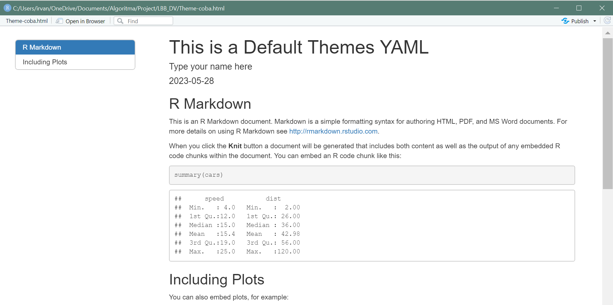
```

### `cerulean`

* **YAML formats**

```{r eval=FALSE}
---
title: "This is a Cerulean Themes YAML"
author: "Type your name here"
date: "`r Sys.Date()`"
output: 
  html_document:
    theme: cerulean
    toc: yes
    toc_float:
      collapsed: true
---
```

* **Result**

```{r, out.width = "80%", echo = FALSE, fig.align = "center"}
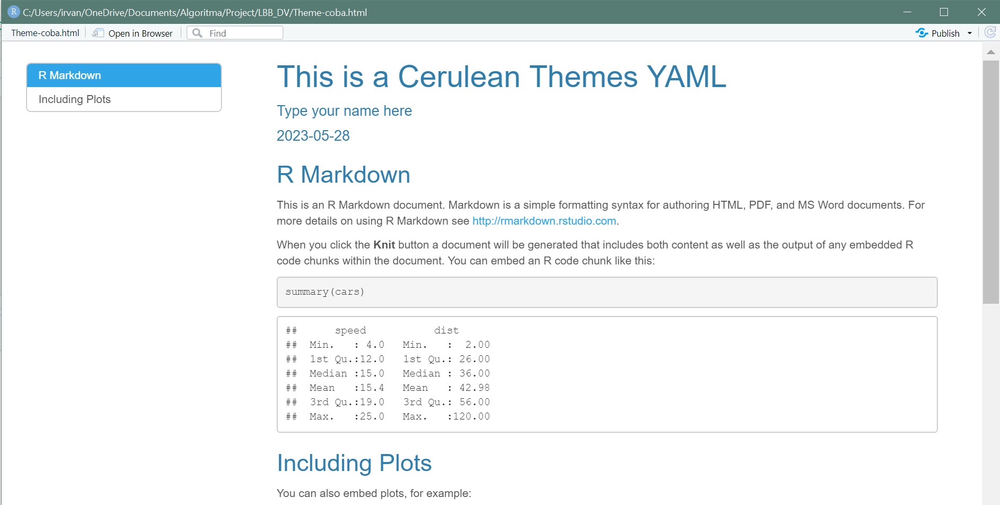
```

### `journal`

* **YAML formats**

```{r eval=FALSE}
---
title: "This is a Journal Themes YAML"
author: "Type your name here"
date: "`r Sys.Date()`"
output: 
  html_document:
    theme: journal
    toc: yes
    toc_float:
      collapsed: true
---
```

* **Result**

```{r, out.width = "80%", echo = FALSE, fig.align = "center"}
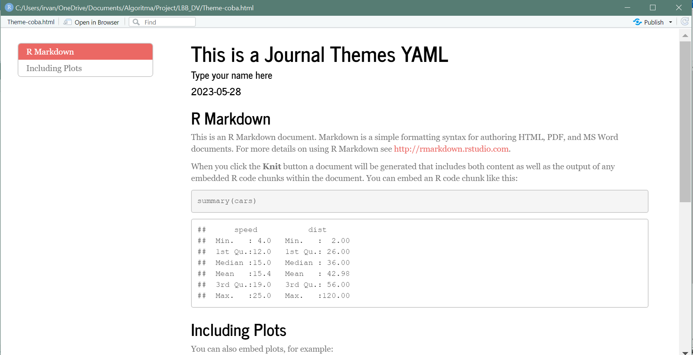
```

### `flatly`

* **YAML formats**

```{r eval=FALSE}
---
title: "This is a Flatly Themes YAML"
author: "Type your name here"
date: "`r Sys.Date()`"
output: 
  html_document:
    theme: flatly
    toc: yes
    toc_float:
      collapsed: true
---
```

* **Result**

```{r, out.width = "80%", echo = FALSE, fig.align = "center"}
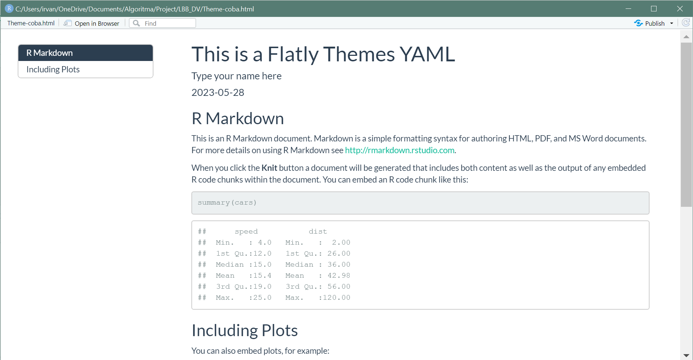
```

### `united`

* **YAML formats**

```{r eval=FALSE}
---
title: "This is a United Themes YAML"
author: "Type your name here"
date: "`r Sys.Date()`"
output: 
  html_document:
    theme: united
    toc: yes
    toc_float:
      collapsed: true
---
```

* **Result**

```{r, out.width = "80%", echo = FALSE, fig.align = "center"}
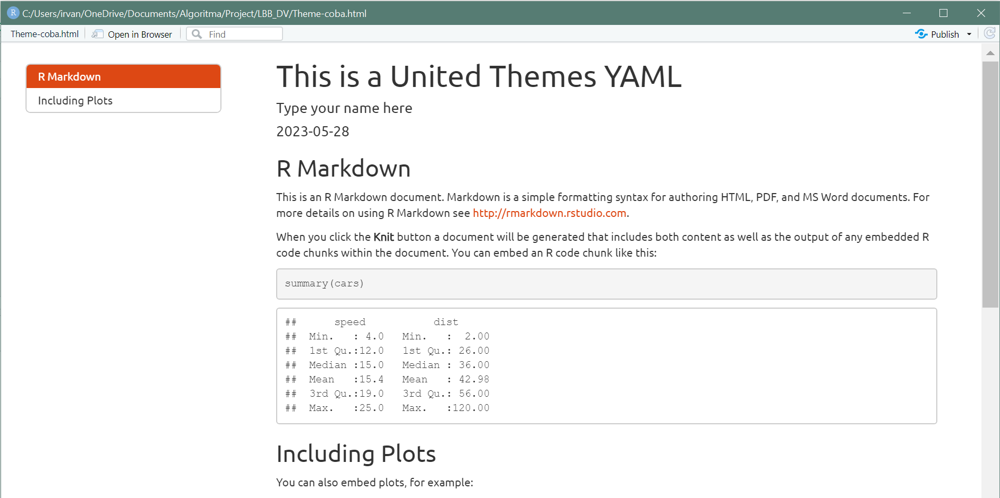
```

### `cosmo`

* **YAML formats**

```{r eval=FALSE}
---
title: "This is a Cosmo Themes YAML"
author: "Type your name here"
date: "`r Sys.Date()`"
output: 
  html_document:
    theme: cosmo
    toc: yes
    toc_float:
      collapsed: true
---
```

* **Result**

```{r, out.width = "80%", echo = FALSE, fig.align = "center"}
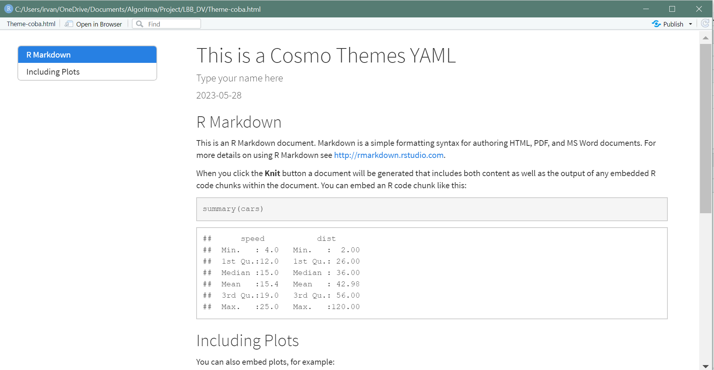
```

### `simplex`

* **YAML formats**

```{r eval=FALSE}
---
title: "This is a Simplex Themes YAML"
author: "Type your name here"
date: "`r Sys.Date()`"
output: 
  html_document:
    theme: simplex
    toc: yes
    toc_float:
      collapsed: true
---
```

* **Result**

```{r, out.width = "80%", echo = FALSE, fig.align = "center"}
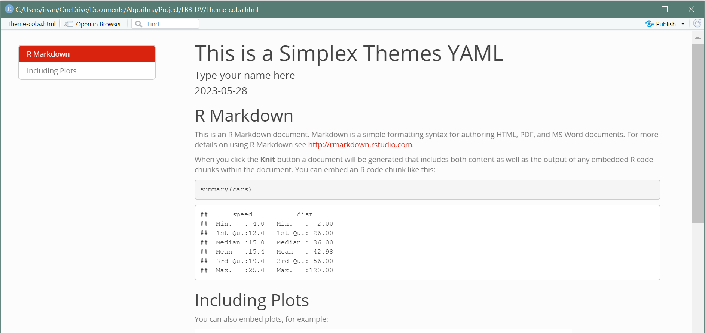
```

## `prettydoc` Package Theme

### `cayman` 

The Default Theme from `prettydoc` package

* **YAML formats**

```{r eval=FALSE}
---
title: "This is a Cayman Themes YAML from `prettydoc` Package"
author: "Type your name here"
date: "`r Sys.Date()`"
output: 
  prettydoc::html_pretty:
    theme: cayman
    toc: yes
---
```

* **Result**

```{r, out.width = "80%", echo = FALSE, fig.align = "center"}
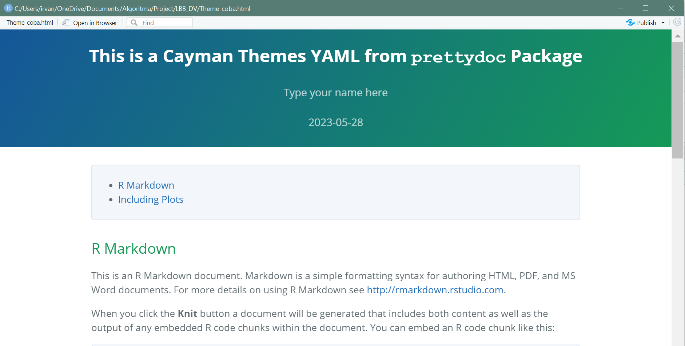
```

### `leonids`

* **YAML formats**

```{r eval=FALSE}
---
title: "This is a Leonids Themes YAML from `prettydoc` Package"
author: "Type your name here"
date: "`r Sys.Date()`"
output: 
  prettydoc::html_pretty:
    theme: leonids
    toc: yes
---
```

* **Result**

```{r, out.width = "80%", echo = FALSE, fig.align = "center"}
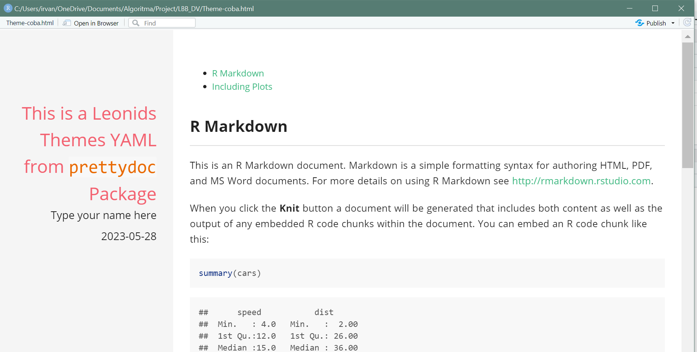
```

### `architect`

* **YAML formats**

```{r eval=FALSE}
---
title: "This is a Architect Themes YAML from `prettydoc` Package"
author: "Type your name here"
date: "`r Sys.Date()`"
output: 
  prettydoc::html_pretty:
    theme: architect
    toc: yes
---
```

* **Result**

```{r, out.width = "80%", echo = FALSE, fig.align = "center"}
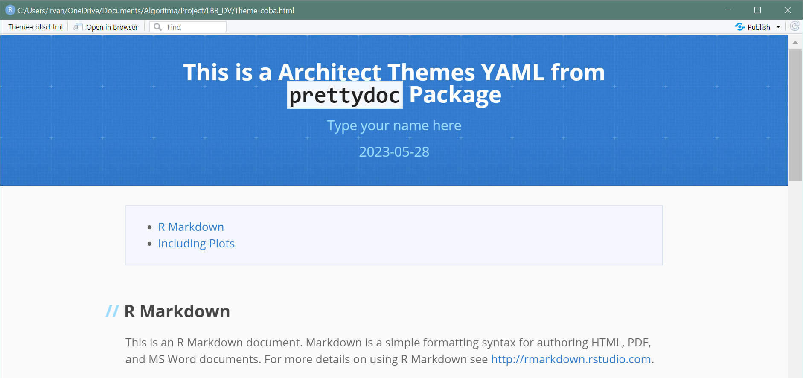
```

### `hpstr`

* **YAML formats**

```{r eval=FALSE}
---
title: "This is a hpstr Themes YAML from `prettydoc` Package"
author: "Type your name here"
date: "`r Sys.Date()`"
output: 
  prettydoc::html_pretty:
    theme: hpstr
    toc: yes
---
```

* **Result**

```{r, out.width = "80%", echo = FALSE, fig.align = "center"}
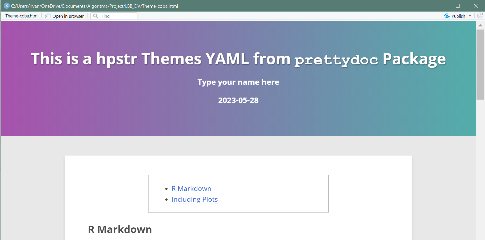
```

### `tactile`

* **YAML formats**

```{r eval=FALSE}
---
title: "This is a Tactile Themes YAML from `prettydoc` Package"
author: "Type your name here"
date: "`r Sys.Date()`"
output: 
  prettydoc::html_pretty:
    theme: tactile
    toc: yes
---
```

* **Result**

```{r, out.width = "80%", echo = FALSE, fig.align = "center"}
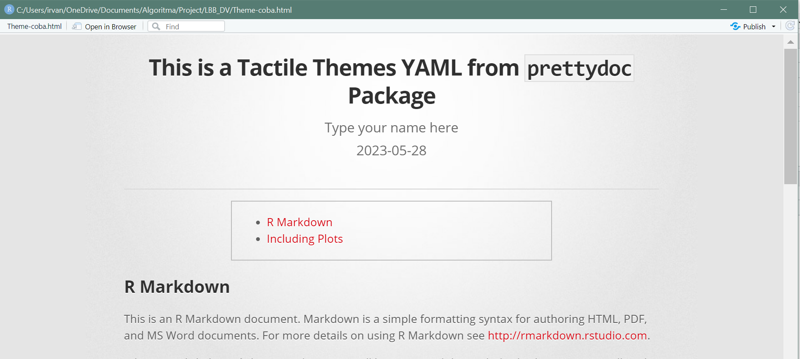
```

## `rmdformats`` Package Theme

Documentation: https://cran.r-project.org/web/packages/rmdformats/index.html

### `html_clean`

* **YAML formats**

```{r eval=FALSE}
---
title: "This is a html_clean Themes YAML from `rmdformats` Package"
author: "Type your name here"
date: "`r Sys.Date()`"
output: 
  rmdformats::html_clean
---
```

* **Result**

```{r, out.width = "80%", echo = FALSE, fig.align = "center"}
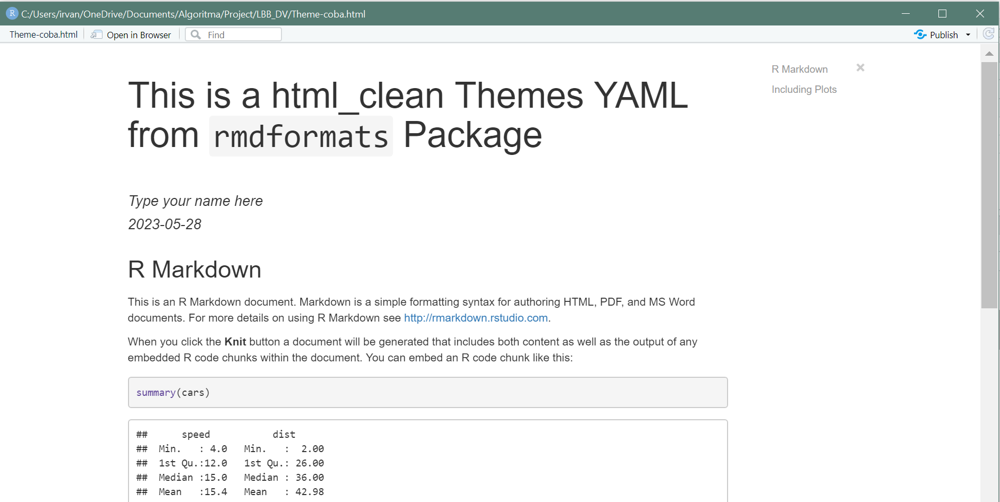
```

### `readthedown`

* **YAML formats**

```{r eval=FALSE}
---
title: "This is a readthedown Themes YAML from `rmdformats` Package"
author: "Type your name here"
date: "`r Sys.Date()`"
output: 
  rmdformats::readthedown
---
```

* **Result**

```{r, out.width = "80%", echo = FALSE, fig.align = "center"}
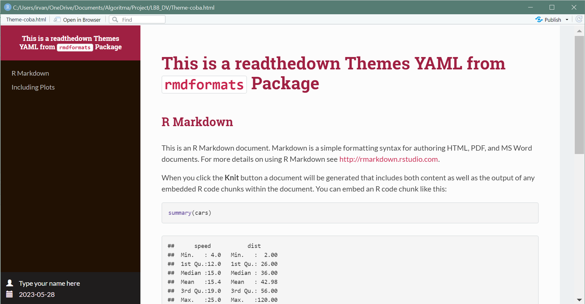
```

### `material`

* **YAML formats**

```{r eval=FALSE}
---
title: "This is a material Themes YAML from `rmdformats` Package"
author: "Type your name here"
date: "`r Sys.Date()`"
output: 
  rmdformats::material
---
```

* **Result**

```{r, out.width = "80%", echo = FALSE, fig.align = "center"}
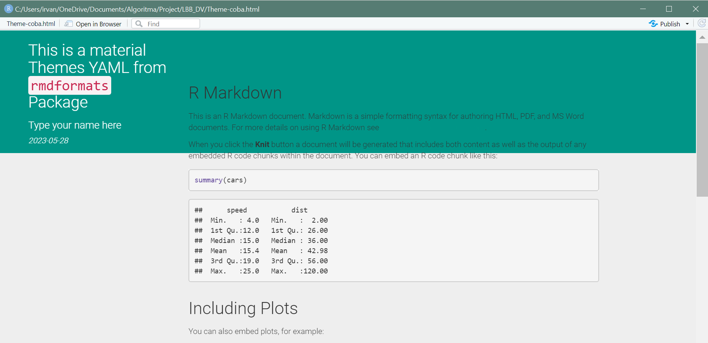
```

## `tint` Package Theme

Documentation: 

* R-Cran: https://cran.r-project.org/web/packages/tint/index.html

* Github: https://github.com/eddelbuettel/tint

### `tintHtml`

* **YAML formats**

```{r eval=FALSE}
---
title: "This is a tintHtml Themes YAML from `tint` Package"
author: "Type your name here"
date: "`r Sys.Date()`"
output: tint::tintHtml
---
```

* **Result**

```{r, out.width = "80%", echo = FALSE, fig.align = "center"}
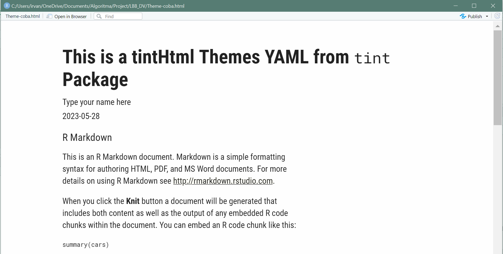
```

## `tufte` Package Theme

Documentation: https://garrettgman.github.io/rmarkdown/tufte_handout_format.html

### `tufte_html`

* **YAML formats**

```{r eval=FALSE}
---
title: "This is a tufte_html Themes YAML from `tufte` Package"
author: "Type your name here"
date: "`r Sys.Date()`"
output: tufte::tufte_html
---
```

* **Result**

```{r, out.width = "80%", echo = FALSE, fig.align = "center"}
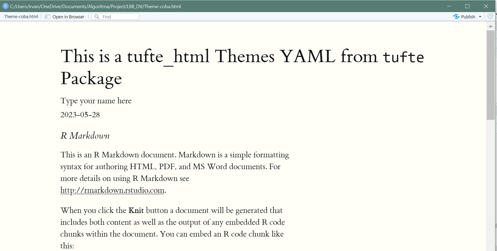
```

# CSS- Custom Your Own Theme 

Additionally, if you have more advanced knowledge of CSS, you can create your own custom themes or modify existing ones. This allows you to tailor the appearance of your documents to match your specific requirements or branding guidelines. By overriding the default styles, you can customize fonts, colors, background images, and other design elements.

* **css Document**

A CSS (Cascading Style Sheets) document is a file that contains CSS code, which is a language used to describe the style and formatting of a document written in HTML (Hypertext Markup Language) or XML (eXtensible Markup Language).

CSS documents provide a powerful and flexible way to control the visual presentation of web pages, allowing you to define styles, layouts, colors, and other visual aspects of your website, separate from the actual content

A typical CSS document consists of a series of selectors and declarations. Selectors are used to target specific HTML elements, while declarations define the desired styles for those elements. Here's a simple example:

```{r eval=FALSE}
h1 {
    font-size: 1.8em;
    font-weight: bolder;
    color: #467d62;

}

h2 {
    font-size: 1.6em;
    font-weight: bolder;
    color: #FB5151;
}

h3,h4 {
    font-size: 1.3em;
    font-weight: bolder;
    color: #990000;
}
```

You can make your own css in any text editor (ex: Notepad).

* **YAML formats**

```{r eval=FALSE}
---
title: "Programming for Data Science: In-Class Material"
author: "Rany Dwi Cahyaningtyas"
date: "Vulcan: 29-31 Mei 2023"
output:
  html_document:
    css: assets/rany_style.css
    df_print: paged
    highlight: tango
    theme: cosmo
    toc: yes
    toc_float:
      collapsed: true
    number_sections: true
---
```

* **Result**

```{r, out.width = "80%", echo = FALSE, fig.align = "center"}
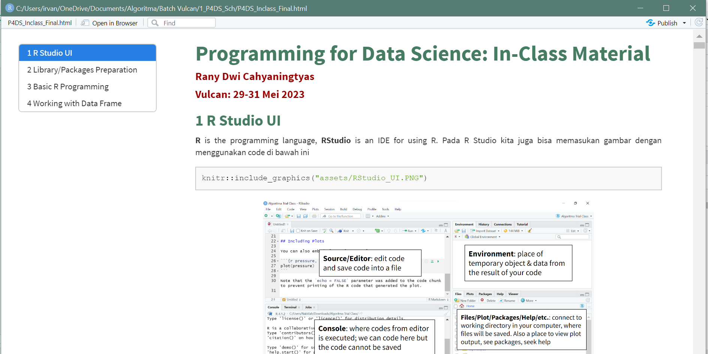
```

# Summary

In summary, R Markdown themes enable you to control the visual aspects of your documents, making them more engaging and professional. Whether you prefer a minimalistic look or a vibrant design, R Markdown themes give you the flexibility to create documents that align with your personal style or organizational branding.

# Reference

- YAML: https://bookdown.org/yihui/rmarkdown/html-document.htmlRMarkdown 
- Theme: https://www.datadreaming.org/post/r-markdown-theme-gallery
- Tips for tidy Rmd: https://holtzy.github.io/Pimp-my-rmd/

